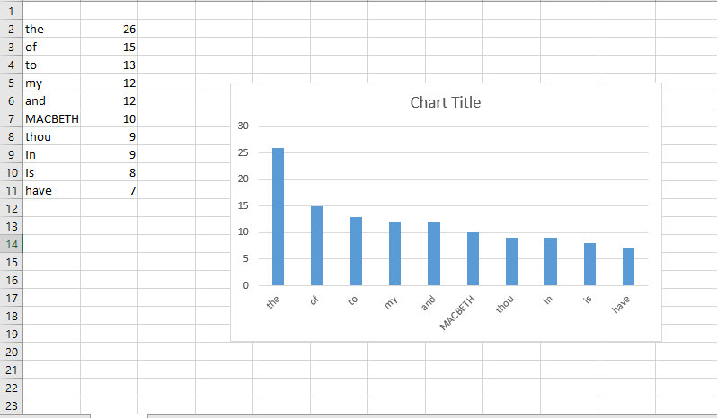

# spark_project
## Data
* I got the data from <br/>
``` http://shakespeare.mit.edu/macbeth/macbeth.1.5.html ```
## Code
* Importing macbeth.txt into spark source directory <br/>
```val romeoRDD = sc.textFile("macbeth.txt");```
* For maintaining the key value pairs of word counts <br/>
```romeoRDD.flatMap(line => line.split(" ")).map(word => (word, 1)).reduceByKey((a, b) => a + b)```
* word count in shell <br/>
```wordCounts.collect()```
* The result will be <br/>
```res0: Array[(String, Int)] = Array((thee.,1), (thou'ldst,1), (reading,1), (sovereign,1), (greatness,,1), (have,7), (holily;,1), (tending;,1), (This,3), (true:,1), (vanished.,1), (wouldst,5), (who,1), (Cawdor;',1), (greatness,1), (it!,1), (ever,1), (read,1), (attend,1), (title,,1), (wrongly,1), (met,1), (make,2), (Who,,1), (woman's,1), (matters.,1), (me,6), (o',1), (fatal,1), (hither,,1), (pour,1), (Under,1), (win:,1), (nature;,1), (scarcely,1), (further.,1), (when,1), (further,,1), (illness,1), (strange,1), (Only,1), (nearest,1), (our,2), (thane,1), (as,2), (Enter,3), (dead,1), (Lay,1), (aid,1), (thee,,1), (visitings,1), (clear;,1), (hoarse,1), (V.,1), (morrow,1), (chastise,1), (them,2), (cries,1), (partner,1), (transported,1), (fellows,1), (is,8), (sway,1), (it;,1), (air,,1), (undone.'...```
* Sorting the word cont <br/>
```val sortedResult = wordCounts.sortBy(_._2,false);```
* data into another file <br/>
```def writingToAFile(f: java.io.File)(i: java.io.PrintWriter => Unit) { val p = new java.io.PrintWriter(f);try { i(p) } finally{ p.close() } } ```

* Getting top 10 words <br/>
```val res10 = sortedResult.take(10);```
* importing java <br/>
'
``` import java.io._```
* Getting final data into output.txt <br/>
```writingToAFile(new File("C:/output.txt")) { p => res10.foreach(p.println) }```
## visualization of data


## References:
* [https://spark.apache.org/downloads.html](https://spark.apache.org/downloads.html)
* [https://github.com/denisecase/setup-spark.git](https://github.com/denisecase/setup-spark.git)
* [http://shakespeare.mit.edu/macbeth/macbeth.1.5.html](http://shakespeare.mit.edu/macbeth/macbeth.1.5.html)
